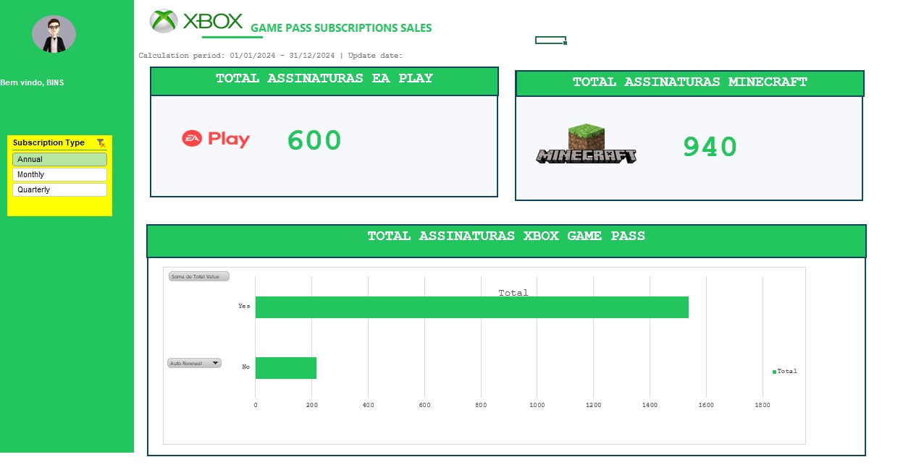

# Dashboard Excel - Bootcamp DIO

Durante o bootcamp Heineken - Inteligência Artificial Aplicada a Dados com Copilot, no módulo Análise de dados com Excel e Copilot, foi proposto um desafio para a criação de um dashboard simples utilizando Excel.

Recursos utilizados
- Tabela dinâmica
- Gráfico dinâmico
- Segmentação de dados
